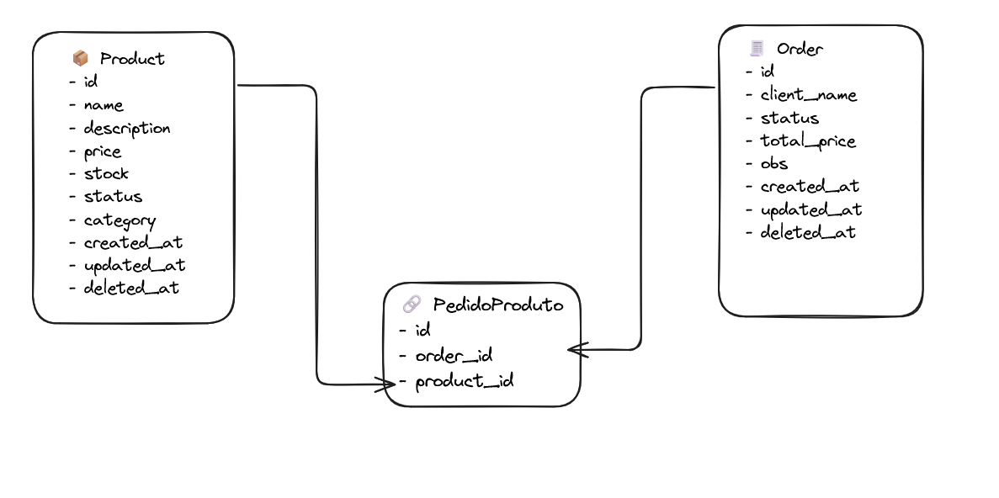

### Sobre a InCicle

A InCicle é uma empresa de tecnologia com foco em soluções para sistemas de gestão, recursos humanos e relacionamentos profissionais.

### Teste Backend

Esse teste consiste em conhecermos um pouco o seu conhecimento na área de desenvolvimento de **apis rest**.
Sendo assim, avaliaremos o seu domínio das linguagem Php ^8.x utilizando o framework Laravel ^12.x.

### Descrição da API

Desenvolver uma Api que atenda à modelagem disponibilizada abaixo(não necessário se limitar a ela), está api deve ser construida com a finalidade de gerenciar atividades de um projeto que podem ser visualizadas por membros desse projeto adicionados pelo administrador.

### DIAGRAMA

### **Requisitos**

## item 0

    Criar tabelas no banco de dados para as entidades acima representadas.

## item 1

    Criar um conjunto de 4 rotas(endpoints) com o CRUD(CREATE/READ/UPDATE/DELETE) dos produtos(Product) para manipular a tabela produto criada no item 0 com base no diagrama proposto

## item 2

    Criar um conjunto de 4 rotas(endpoints) com o CRUD(CREATE/READ/UPDATE/DELETE) dos pedidos(Order) para manipular a tabela pedido criada no item 0. 
    Cada pedido pode ter vários produtos.
    É necessário que o exista estoque para que o produto possa ser colocado em um pedido.
    O preço total do pedido deve considerar todos os produtos selecionados.

### O que iremos avaliar

- Validação das informações que serão gravadas
- A organização do seu projeto e a forma que seu código foi escrito.
- Se a sua solução atende tudo que foi solicitado.

### Itens que nos deixam com mais vontade de ter você no nosso time

- Se preocupou com performance da aplicação.
- Preocupação com os testes
- Logs da aplicação(Registros das etapas do CRUD)
